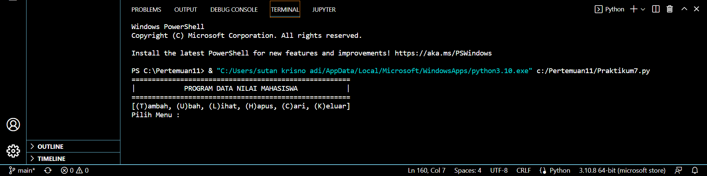

# Praktikum7

# Latihan

Masukan codingan seperti dibawah ini:

import math
# Sutan Krisno Adi

def a(n): return lambda x: x**n

lambdaA = a(4)
print(lambdaA(4))

def b(i, j):
    return lambda x, y: math.sqrt(x**i + y**j)

lambdaB = b(4,0)
print(lambdaB(3, 0))

def c(*args):
    return lambda * params: sum(args) / len(params)

lambdaC = c(1, 2, 3, 4, 5)
print(lambdaC(1, 1, 5))

def d(firstname):
    return lambda * lastname: "".join(set(firstname)) + "".join(set(lastname))

lambdaD = d("Sutan")
print(lambdaD(" Krisno " + " Adi "))

Hasil Output

# Tugas Praktikum

Buat program sederhana dengan mengaplikasikan penggunaan fungsi
yang akan menampilkan daftar nilai mahasiswa, dengan ketentuan:
• Fungsi tambah() untuk menambah data
• Fungsi tapilkan() untuk menampilkan data
• Fungsi hapus(nama) untuk menghapus data berdasarkan nama
• Fungsi ubah(nama) untuk mengubah data berdasarkan nama
• Buat flowchart dan penjelasan programnya pada README.md.

Masukan Codingan sebagai berikut:

from os import system
d_nama = []
d_nim = []
d_tugas = []
d_uts = []
d_uas = []
d_akhir = []

def head():
    print('======================================================')
    print('|            PROGRAM DATA NILAI MAHASISWA            |')
    print('======================================================')

def menu():
    head()
    print('[(T)ambah, (U)bah, (L)ihat, (H)apus, (C)ari, (K)eluar]')
    pilih2 = input('Pilih Menu :  ')
    if pilih2 == 't':
        tambah()
    elif pilih2 == 'u':
        ubah()
    elif pilih2 == 'l':
        lihat()
    elif pilih2 == 'h':
        hapus()
    elif pilih2 == 'c':
        cari()
    elif pilih2 == 'k':
        keluar()
    else:
        tidak = input('Menu Tidak Ada ')
        system('cls')
        menu()

def tambah():
    system('cls')
    print('                 Tambah Data Mahasiswa                ')
    print('======================================================')
    nama = input('Nama        : ')
    d_nama.append(nama)
    nim = input('Nim         : ')
    d_nim.append(nim)

    tugas = float(input('Nilai Tugas : '))
    j_tugas = tugas * (30 / 100)
    d_tugas.append(j_tugas)

    uts = float(input('Nilai UTS   : '))
    j_uts = uts * (35 / 100)
    d_uts.append(j_uts)

    uas = float(input('Nilai UAS   : '))
    j_uas = uas * (35 / 100)
    d_uas.append(j_uas)

    total = j_tugas + j_uts + j_uas
    d_akhir.append(total)
    print('Data Tersimpan'.center(40))
    kembali = input('Kembali [enter]')
    menu()

def ubah():
    system('cls')
    print("----- Ubah Data Mahasiswa -----")
    namm = input('Masukkan Nama Mahasiswa : ')
    for i in range(len(d_nama)):
        if namm == d_nama[i]:
            namabaru = input('Nama        : ')
            d_nama[i] = namabaru

            nimbaru = input('Nim         : ')
            d_nim[i] = nimbaru

            tugasb = float(input('Nilai Tugas : '))
            j_tugasb = tugasb * (35 / 100)
            d_tugas[i] = j_tugasb

            utsb = float(input('Nilai UTS   : '))
            j_utsb = utsb * (35 / 100)
            d_uts[i] = j_utsb

            uasb = float(input('Nilai UAS   : '))
            j_uasb = uasb * (30 / 100)
            d_uas[i] = j_uasb

            totalb = j_tugasb + j_utsb + j_uasb
            d_akhir[i] = totalb
            print('Data Berhasil Dirubah')
            kembali = input('Kembali Tekan [enter]')
            menu()
    else:
        print('Data Tidak Ada')
        kembali = input('Kembali Tekan [Enter]')
        menu()

def lihat():
    head()

    for i in range(len(d_nim)):
        print('%d.  Nama        : %s' % (i + 1, d_nama[i]))
        print('    Nim         : %s' % d_nim[i])
        print('    Tugas       : %.2f' % d_tugas[i])
        print('    UTS         : %.2f' % d_uts[i])
        print('    UAS         : %.2f' % d_uas[i])
        print('    Nilai Akhir : %.2f' % d_akhir[i])
        print('---------------------------')
    kembali = input('Kembali Tekan [enter]')
    menu()

def hapus():
    system('cls')
    print('         Hapus Data Mahasiswa        ')
    print('=====================================')
    namm = input('Masukkan Nama Mahasiswa : ')
    for i in range(len(d_nama)):
        if namm == d_nama[i]:
            d_nim.remove(d_nim[i])
            d_nama.remove(d_nama[i])
            d_tugas.remove(d_tugas[i])
            d_uts.remove(d_uts[i])
            d_uas.remove(d_uas[i])
            d_akhir.remove(d_akhir[i])

            print('Data Berhasil Dihapus')
            kembali = input('Kembali Tekan [enter]')
            menu()
    else:
        print('Data Tidak Ada')
        kembali = input('Kembali Tekan [Enter]')
        menu()

def cari():
    system('cls')
    head()
    m_nim = input('Masukkan Nim : ')
    for i in range(len(d_nim)):
        if m_nim == d_nim[i]:
            print('--------------------------')
            print('Nama        : ', d_nama[i])
            print('Nim         : ', d_nim[i])
            print('Tugas       : ', d_tugas[i])
            print('UTS         : ', d_uts[i])
            print('UAS         : ', d_uas[i])
            print('--------------------------')
            print('Nilai Akhir : ', d_akhir[i])
            kembali = input('Kembali Tekan [Enter]')
            menu()

    else:
        print('Data Tidak Ada')
        kembali = input('Kembali Tekan [Enter]')
        menu()

def keluar():
    print('Terima Kasih telah menggunakan Program ini')

menu()

Hasil Output

TAMPILAN AWAL

TAMPILAN TAMBAH DATA

TAMPILAN UBAH DATA

TAMPILAN KETIKA SUDAH MENGUBAH DATA

TAMPILAN HAPUS DATA

TAMPILAN KETIKA KELUAR ATAU SELESAI MENGGUNAKAN PROGRAM

# Flowchart

# Mohon maaf jika ada kekurangan
# Sekian dan Terima Kasih